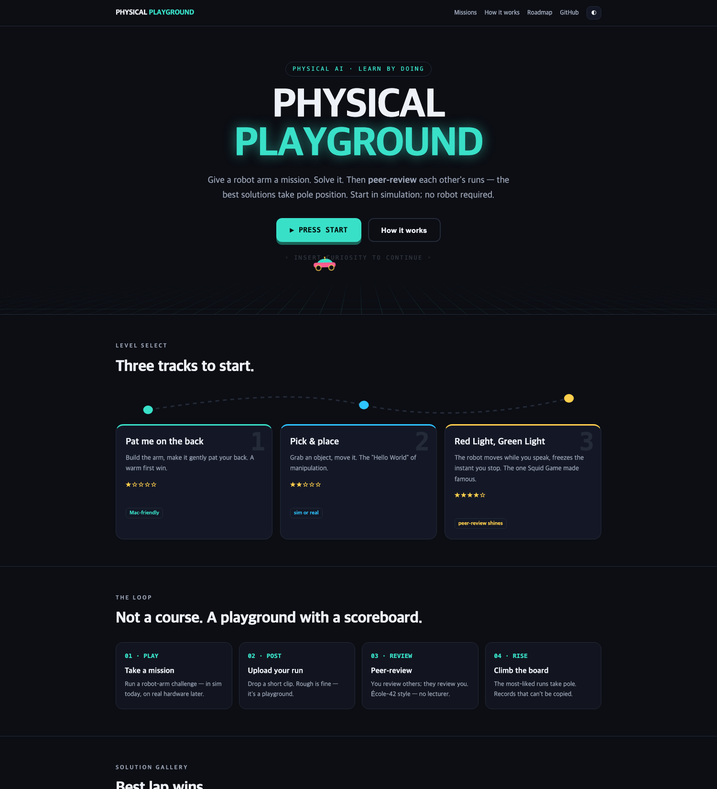
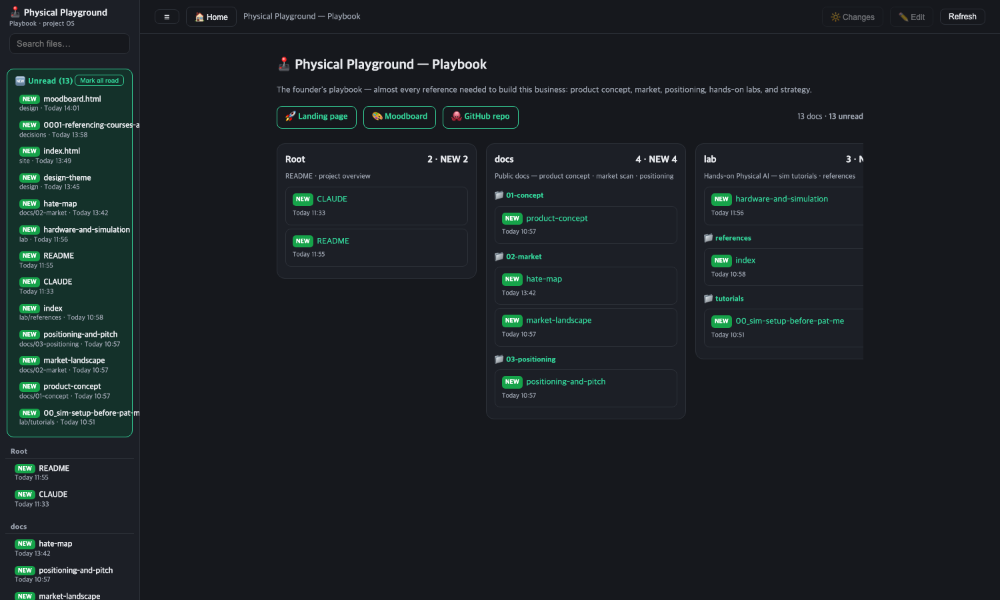

# Physical Spark

*(product name; the repo keeps its original `physical-spark` name)*

A peer-review school for **Physical AI** — **robotics that feels like play**, for developers who want to break into robotics.

> 🌐 **Live:** **https://physical-spark.bit-habit.com** — playable landing, courses, and the join page.
> 👋 **New here?** Start with **[ONBOARDING.md](ONBOARDING.md)** (a guided map of every doc) or **[why join us](https://physical-spark.bit-habit.com/join.html)**.

We give a student a robot-arm mission. They build it, they solve it, and
they upload a short video of the result. Then students review each other's
work. The solutions that get the most likes rise to the top of the gallery.

The idea mixes two things:

- The **peer-review** learning model of École 42 — students learn by
  reviewing each other's work, not by listening to a teacher.
- **Playground games** — the kind of simple games you saw in *Squid Game*.

## The missions

We start very easy — your first win comes fast, even if you've never touched a robot.

1. **"Pat me on the back"** — Build the robot arm and make it gently pat your
   back, left and right. (Goal: a warm first win, with a low bar for success.)
2. **Pick & place** — Grab an object and move it. A ladder of small steps that
   slowly get harder.
3. **"Red Light, Green Light"** — The robot moves while
   you speak, and stops the moment you stop talking. Voice input, end-of-speech
   detection, background noise, and many languages make this an open problem —
   which is exactly why peer review matters here.

## Why this is different

This is not a textbook. It is a **learning operating system**.

Content is easy to copy. A community and its records are not. The real product
is the peer review, the video gallery made by the users, and the data that
builds up over time.

## Tech direction

- **Hardware:** low-cost, open-source robot arms (SO-101 class).
- **Software:** the Hugging Face **LeRobot** ecosystem.
- **Platform (the part we build):** post a mission → upload a solution video →
  peer review → a "most-liked" gallery.

## Notes (building in public)

- [Product concept](docs/01-concept/product-concept.md) — the missions, and why "textbook vs. platform" is the fork in the road.
- [**Curriculum vision — start and end**](docs/01-concept/curriculum-vision.md) — the ladder from a \$0 MacBook sim to the graduation mission ("say *pick that up* and it does"), and — more importantly — [what we deliberately cut](docs/01-concept/curriculum-vision.md#3-무엇을-빼는가-이게-더-중요하다): ROS, embedded, LiDAR, five-finger hands.
- [Market landscape](docs/02-market/market-landscape.md) — US & China scan: HF/LeRobot, NVIDIA, Makeblock, DJI, and the gaps.
- [The "Hate" Map](docs/02-market/hate-map.md) — mined negative reviews of competitors, clustered into pain themes → our openings.
- [Positioning & pitch](docs/03-positioning/positioning-and-pitch.md) — value proposition, a glossary for developers, and the pitch.
- [**Career track & services**](docs/06-career/career-and-services.md) — why Physical AI, told honestly: Korea is #1 in the world in robot density and has made "Physical AI #1 by 2030" a national goal — *and* robotics job postings are still one-fifth of React's. The money arrived before the hiring. That lag is the window.
- [**Physical AI Korea playbook**](docs/07-strategy/physical-ai-korea-playbook.md) — strategy for a non-engineering founder: winning without an engineering base, a Plug-and-Play go/no-go, the real Korean funding ladder (딥테크 예비창업패키지 → 블루포인트/퓨처플레이 → TIPS → YC), and a mentor's advice **cross-verified against sources** — where it's wrong, it says so.

## Hands-on lab (learning in public)

- [Simulation setup — up to just before "pat me"](lab/tutorials/00_sim-setup-before-pat-me.md) — get a Physical AI dev environment running in sim (Mac path + NVIDIA Isaac path).
- [Hardware & simulation guide](lab/hardware-and-simulation.md) — what you can actually run on (RTX, cloud GPU, SO-101) before buying a real arm.
- [Tutorial reference collection](lab/references/index.md) — curated NVIDIA / Hugging Face LeRobot tutorials, with hardware/OS requirements.
- [Course teardown — HF LeRobot vs NVIDIA](lab/references/course-analysis-hf-nvidia.md) — the two flagship courses, dissected as raw material for our own curriculum.

## The project, run as a system

This isn't just a repo of docs — it's run like an operating system for the venture. A local
**Playbook** dashboard turns every product/market/strategy note, hands-on lab, and design decision
into a browsable, searchable board (built with zero dependencies — a tiny Python server + one HTML file).
Decisions are logged as [ADRs](decisions/), the public/private boundary is enforced by structure, and the
whole thing doubles as a build-in-public trail.

## The thinking (building in public)

I'm *new* to Physical AI. But being new doesn't mean being shallow — I go deep on the "why," and I try
really hard to make the learning **fun**. This repo keeps the trail of that thinking, on purpose:

- **[Design theme](design/design-theme.md)** — why the whole thing borrows the *feeling* of the 1999 RC-racing
  game **Re-Volt** (toy-scale wonder), and how that becomes a color/type/motif system.
- **[Decision records (ADRs)](decisions/)** — the calls I didn't want to re-litigate later. Each one logs the *context* and the *why*:
  [0001 — referencing courses & contribution model](decisions/0001-referencing-courses-and-contribution-model.md) ·
  [0002 — handling private elements](decisions/0002-handling-private-elements.md).
- **[Foundations map](knowledge/00-foundations.md)** — the "two worlds" (classical ROS vs. learning-based
  Physical AI) I had to draw for myself before any course made sense.
- **[A robot's anatomy — arm, hand, eye](knowledge/04-arm-hand-eye.md)** — cutting the robot by *part*
  instead of by *layer*, and fact-checking the folklore against 2026 sources. **The arm really is a
  commodity** and **the hand really is the IP** (Tesla sued its Optimus *hand* lead for trade secrets —
  nobody sues over an arm). But the most repeated line in robotics — **"LiDAR is the robot's eye,
  cameras will never work"** — **is wrong for manipulation**: π0.5, GR00T, Figure Helix and Optimus
  are all RGB-only. That claim is about the robot's *legs*. We teach its *hands*.
- **[How robots learn — the learning ladder](knowledge/06-robot-learning-ladder.md)** — the trunk of the
  LeRobot "Robot Learning" tutorial, digested: from classical control up through RL, imitation learning
  (ACT / Diffusion Policy) to VLA foundation models (π0, SmolVLA). **Rules shrink, data grows** as you climb.
- **Industry & job-market notes** — where the money and the jobs actually are:
  [job market: ROS vs Physical AI](knowledge/01-job-market-ros-vs-physical-ai.md) ·
  [robot industry landscape](knowledge/02-robot-industry-landscape.md) ·
  [players & the money](knowledge/03-physical-ai-players-and-money.md) ·
  [company atlas by vertical](knowledge/05-robotics-company-atlas.md).

The bet: *how* someone learns to build should itself be built with care and joy. This whole workspace is that,
run as a system.

## Under the hood (engineering write-ups)

The platform is built in public too — each moving part gets a plain-language, file-by-file explainer:

- **[Session & nickname lifecycle](docs/engineering/session-and-nickname.md)** — how a login session gets its `pr_session` cookie and how a random name like `brave-otter-42` is minted, displayed, and reused. Real functions (`verify`, `current_user`, `generate_nickname`) + Mermaid diagrams.
- **[Passwordless email login](docs/engineering/passwordless-email-auth.md)** — the magic-link security flow end-to-end: one-time hashed tokens, TTLs, cookie attributes, and the k3s + Traefik path split.
- **[Deployment](docs/04-ops/deployment.md)** — `git push` → GitHub Actions → self-hosted k3s (Traefik + cert-manager).
- **[Running many AI agents in parallel](docs/engineering/multi-agent-git-worktrees.md)** — using git worktrees to split branches/folders across concurrent Claude Code sessions.

## Live & in progress (building in public)

The site is live at **https://physical-spark.bit-habit.com** and grows one piece at a time — here's the running state:

- ✅ **Landing** — warm Re-Volt theme + a playable mini-game.
- ✅ **Courses** ([`/courses`](https://physical-spark.bit-habit.com/courses/)) — dynamic curriculum:
  **Mission 0 — Setup & First Simulation** (install LeRobot on a Mac, run your first MuJoCo sim), then Missions 1–3
  (Pat me → Pick & place → Red Light, Green Light).
- ✅ **Join page** ([`/join.html`](https://physical-spark.bit-habit.com/join.html)) — the pitch and market.
- ✅ **Hosting** — self-hosted on k3s (Traefik + cert-manager); `git push` → GitHub Actions → deploy ([how it works](docs/04-ops/deployment.md)).
- 🔨 **In progress:** passwordless **sign-in** — email magic-link, plus a random English nickname minted once per account. How a session gets its name, file-by-file: **[session & nickname lifecycle](docs/engineering/session-and-nickname.md)**.
- 🗺️ **Next:** peer-review upload + gallery; more course lessons; Apple passkey login.

Still early — Week 1 was choosing and ordering the first robot arm. Follow the trail in
[ONBOARDING.md](ONBOARDING.md) and the [build logs](logs/).

---

Built by [bookseal](https://github.com/bookseal) · portfolio: [bit-habit.com](https://bit-habit.com)
