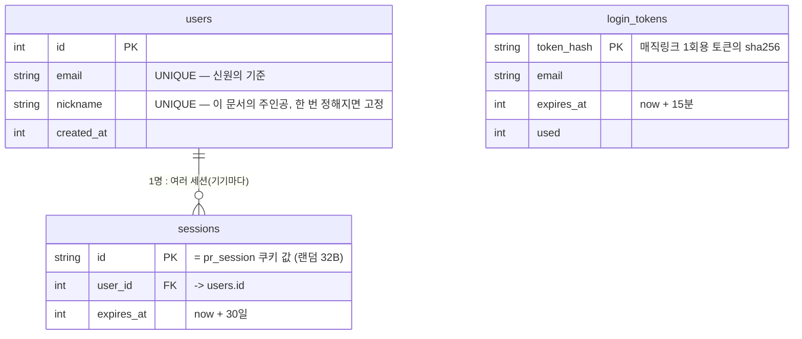
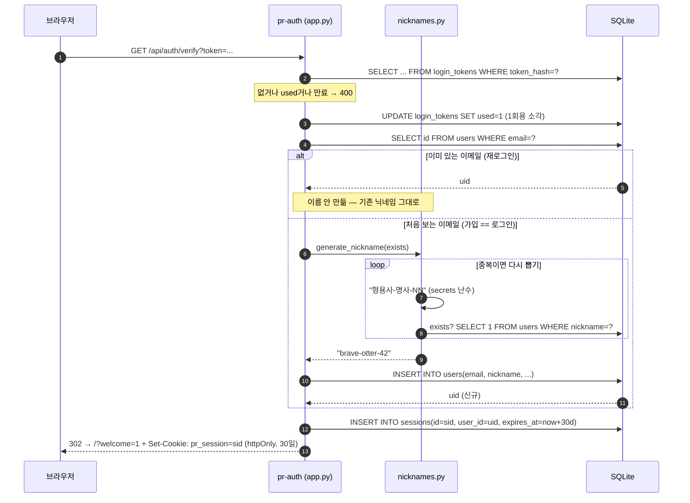
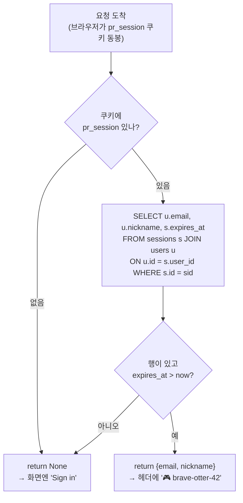
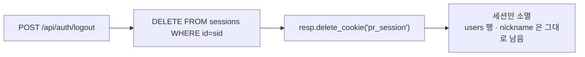

# 세션에 "이름"이 붙는 원리 — `pr_session` 쿠키와 랜덤 닉네임의 생애주기

> **대상:** 우리 로그인 코드를 처음 읽는 사람 (École 42 수준 — C·HTTP는 알지만 쿠키/세션/DB 세부는 새로울 수 있음).
> **목표:** README에 "email magic-link, random English nickname" 한 줄로만 적혀 있어 추상적인 그 문장을,
> **실제 파일·함수·DB 테이블 단위로** 끝까지 따라가 이해하기.
> **범위:** 이 문서는 매직링크의 *보안 흐름*이 아니라, 로그인한 뒤 **세션과 그 세션의 "이름(닉네임)"이 어떻게 태어나
> 화면에 살아 움직이다 사라지는가**에 집중합니다. 보안 흐름(토큰 해싱·TTL·쿠키 속성)은
> → [passwordless-email-auth.md](passwordless-email-auth.md) 를 보세요.

---

## 1. 한 문장으로

- **세션(session)** = "너 지금 로그인 상태야"를 들고 다니는 브라우저 쿠키 `pr_session`. 30일마다 갈리고, 로그아웃하면 사라진다.
- **이름(name)** = 그 세션이 가리키는 유저의 닉네임 `brave-otter-42`. **첫 로그인 때 딱 한 번** 만들어져 계정과 **영원히** 함께 간다.

이 둘은 수명이 다르다. 세션은 갈아끼워도 이름은 그대로다 — 이게 핵심이고, README 한 줄에선 안 보이는 부분이다.

---

## 2. 등장하는 파일과 함수 (실제 이름)

| 파일 | 함수/심볼 | 역할 |
|---|---|---|
| `auth/app.py` | `verify(token)` | 매직링크 클릭을 받아 **유저를 찾거나 만들고**, 세션을 발급하고, `pr_session` 쿠키를 심음 |
| `auth/app.py` | `current_user(request)` | 쿠키의 세션 id로 **"지금 누구냐"**를 DB에서 해석 (`{email, nickname}` 또는 `None`) |
| `auth/app.py` | `me(request)` | `current_user`를 감싼 API 엔드포인트 `/api/auth/me` |
| `auth/app.py` | `logout(request)` | 세션 행 삭제 + 쿠키 삭제 (이름은 안 지움) |
| `auth/app.py` | `post_score(req, request)` | 미니게임 점수를 **닉네임으로** 기록 (`u["nickname"]`) |
| `auth/app.py` | `init_db()` | `users` · `sessions` · `login_tokens` · `scores` 테이블 스키마 |
| `auth/nicknames.py` | `generate_nickname(exists)` | `형용사-명사-숫자` 조합으로 **중복 없는** 랜덤 이름 생성 |
| `site/auth.js` | `refresh()` | 페이지 로드마다 `/me`를 물어 **이름을 헤더에 그림** (없으면 "Sign in") |
| `site/auth.js` | `send()` / `logout(e)` | 이메일 링크 요청 / 로그아웃 버튼 |

---

## 3. 데이터 모델 — 이름과 세션이 사는 곳

`auth/app.py`의 `init_db()`가 만드는 세 테이블의 관계. **이름은 `users`에, 세션은 `sessions`에** 따로 산다.



읽는 법: **한 유저(이름 1개)** 밑에 **세션이 여러 개** 달릴 수 있다(노트북·폰 각각). 세션을 다 지워도 `users` 행과 `nickname`은 남는다.

---

## 4. 이름이 태어나는 순간 — 첫 로그인 시퀀스

여기가 이 문서의 심장이다. 이메일 링크를 클릭하면 `verify()`가 실행되고, **처음 보는 이메일일 때만** `generate_nickname()`이 불린다.



포인트:
- **가입과 로그인이 한 코드 경로다.** `if u:` 분기 하나가 "이미 있으면 로그인 / 없으면 가입+작명"을 가른다. 이름이 태어나는 곳은 이 `else` 한 곳뿐.
- **`generate_nickname(exists)`의 계약:** 후보를 뽑고 → `exists(candidate)`가 참이면(=이미 쓰는 이름) 다시 뽑고 → 아니면 반환. 충돌은 드물지만 반드시 처리한다. 난수는 `random`이 아니라 `secrets`(암호학적) 사용.

---

## 5. 이름이 살아 움직이는 곳 — 매 요청마다의 해석

한 번 만들어진 이름은, 이후 모든 페이지에서 **쿠키 → 세션 → 유저** 순으로 "다시 조회"되어 화면에 나타난다. `current_user()`가 그 해석기다.



이 해석기를 쓰는 세 곳:
- **`me()` → `/api/auth/me`**: `site/auth.js`의 `refresh()`가 페이지 로드마다 호출해, 성공하면 `slot.innerHTML = '🎮 ' + u.nickname`으로 헤더에 이름을 그린다. 실패(401)면 "Sign in" 링크.
- **`post_score()` → `/api/scores`**: 로그인 상태면 타이핑한 이름 대신 `u["nickname"]`으로 점수를 남긴다 — *"로그인한 사람은 자기 세션 이름으로 기록된다."*
- 앞으로 추가될 **피어 리뷰 업로드/갤러리**도 같은 `current_user()`를 재사용하면 된다 (작성자 = 세션 이름).

---

## 6. 이름이 (안) 사라질 때 — 로그아웃



그래서 로그아웃 후 다시 같은 이메일로 로그인하면 **같은 이름으로 돌아온다.** (§4에서 이메일이 이미 `users`에 있으므로 `else` 분기를 안 타고, 새 세션만 발급.)

---

## 7. 왜 이렇게 설계했나 (한눈에)

- **이메일을 신원, 닉네임을 표시명으로 분리** → 사용자는 이메일을 노출하지 않고도 갤러리·스코어보드에서 일관된 정체성을 갖는다.
- **닉네임을 서버에서 자동 생성** → 가입 폼에 "이름을 정하세요" 단계가 없다. 초등학생도 클릭 한 번으로 계정이 생긴다(제품 목표와 정합).
- **세션 id = 랜덤 토큰을 쿠키로** → 서버는 상태를 DB에 두고, 브라우저는 열쇠만 든다. 이름/이메일은 쿠키에 안 담긴다(탈취해도 신원 정보가 안 샘).
- 난수는 전부 **`secrets`** — 세션 id(`_token()`)도 닉네임 숫자(`secrets.randbelow`)도 추측 불가.

---

## 8. 직접 만져보기

```bash
# pr-auth를 로컬에서 띄우고 (dev 모드면 매직링크가 pod 로그에 찍힘)
# 첫 verify 후 SQLite를 열어 "이름이 태어났는지" 확인
sqlite3 /data/auth.db "SELECT email, nickname, created_at FROM users;"
sqlite3 /data/auth.db "SELECT id, user_id, expires_at FROM sessions;"
```

`users`에 행이 하나 생기고 `sessions`에 그 유저를 가리키는 행이 생겼다면 — 방금 §4 시퀀스를 실제로 한 바퀴 돈 것이다.

---

*관련 문서: [매직링크 보안 흐름 전체](passwordless-email-auth.md) · [배포(k3s + GitHub Actions)](../04-ops/deployment.md) · 서비스 운영 노트 [`auth/README.md`](../../auth/README.md)*
