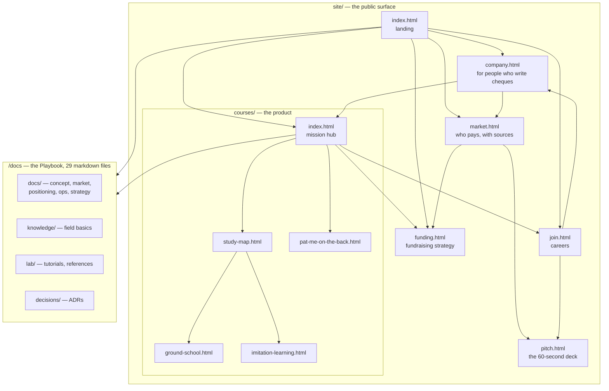

# Site map — what is public, and for whom

> The public site (`site/`) and the Playbook (`/docs`) are two different things with two
> different readers. This file is the picture of both, so structural decisions get made against
> the shape rather than page by page. Regenerate the numbers with the commands at the bottom.
>
> Snapshot: 2026-08-06.

---

## The shape



## The three tiers, by reader

| Tier | Pages | Reader | Question they arrived with |
|---|---|---|---|
| **Front door** | `index` · `company` · `market` · `pitch` | investor, partner, press | Is this real? |
| **Product** | `courses/` and its four sub-pages | a developer who might compete | Can I do this? |
| **Recruiting** | `join` | someone who might build it | Should I join? |
| **Strategy** | `funding` | *nobody external* — see below | — |

## Language state

| Page | Korean chars | What the Korean is |
|---|---:|---|
| `funding.html` | **12,613** | the whole document |
| `index.html` | 293 | the `#read` reading-path section |
| `market.html` | 51 | Korean programme names (국민내일배움카드) and Korean source titles |
| `courses/index.html` | 13 | chapter-pager labels (← 2장 / 4장 →) |
| `join.html` | 11 | residual |
| `courses/study-map.html`, `courses/imitation-learning.html` | 4 each | the voice command `"저거 집어"` — an example utterance, not UI |
| everything else | 0 | — |

**97% of the site's Korean is one page.** Two kinds of Korean are worth telling apart:

- **Untranslatable proper nouns** — 국민내일배움카드, K-Digital Training, and the titles of Korean
  sources being cited. These *should* stay Korean; translating a programme's name makes it
  unfindable. A small English gloss beside them is the right treatment.
- **Prose that happens to be Korean** — the reading path, the pager labels, `funding.html`. This is
  where the site reads as unfinished to an English reader.

## Placement rules

Reachability today: **nav** carries Company · Market · Missions with the 60-second pitch as the
one emphasised action; **footer** carries Join us · 자금 조달 · Playbook · GitHub. Both are rendered
by `site/nav.js`, so placement is decided in one file. Every page is reachable; there are no
orphans.

The distinction the site does not yet enforce:

> **Playbook = everything we know. Site = what we want a stranger to read.**

`/docs` is the right home for working material — it already holds
`docs/07-strategy/physical-ai-korea-playbook.md`, the Korea-side sibling of `funding.html`.

### `funding.html` is on the wrong side of that line

It is not a market page. It contains the diagnosis of why the current setup is hard to fund, a
connection map, Delaware-flip costs, an execution deadline, and attributed advice. Published on
the public site, it hands the people being raised from a view of the negotiating position —
including where it is weak. That is a strategy memo, and the Playbook is where strategy memos go.

Note it does **not** duplicate the existing Korea playbook doc: that one covers PnP / TIPS /
예비창업, this one covers the US flip and connections. They are complementary, and both belong in
`/docs`.

## Regenerate

```bash
# per-page Korean count
for f in $(find site -name '*.html' | sort); do
  printf "%-38s %s\n" "$f" "$(grep -oE '[가-힣]' "$f" | wc -l | tr -d ' ')"; done

# link graph between site pages
grep -ohE 'href="[^"]+\.html[^"]*"' site/*.html site/courses/*.html | sort | uniq -c | sort -rn
```
