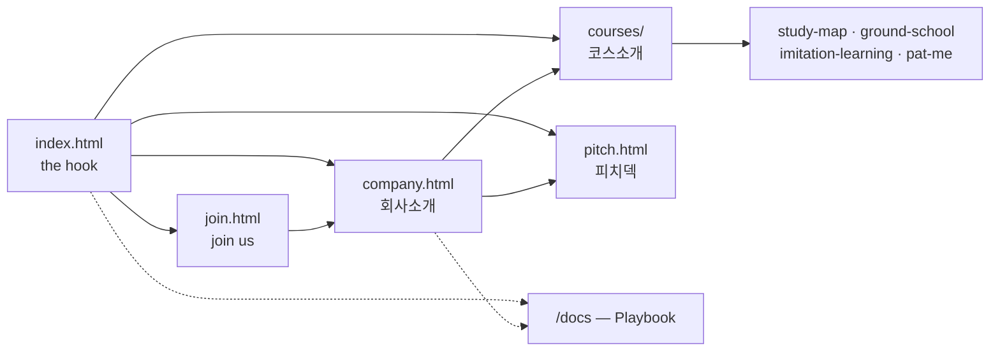

# Site map — what is public, and for whom

> The public site (`site/`) and the Playbook (`/docs`) are two different things with two
> different readers. This file is the picture of both, so structural decisions get made against
> the shape rather than page by page. Regenerate the numbers with the commands at the bottom.
>
> Snapshot: 2026-08-06.

---

## The shape — five public pages



Nav carries **Company · Courses · Join us** with **60s pitch** as the one emphasised action; the
brand goes home. `pitch.html` keeps its own 60-second HUD instead of the site nav — it is on screen
during a live pitch.

### What left the public site, and why

| Page | Moved to | Because |
|---|---|---|
| `funding.html` | `docs/07-strategy/us-vc-connections.html` | A fundraising strategy memo — connection map, flip costs, deadline. Publishing it shows the negotiating position to the people being raised from. |
| `market.html` | retired; `docs/02-market/global-market.md` already held the reasoning | It was an appendix promoted to the nav: nothing linked *into* it. Its v0 prices were carried into the Playbook doc first, since they existed nowhere else. |
| `pit.html` | `docs/07-strategy/pit-lane-industry-intro.html` | Self-labelled 내부 작업대. It is now the canonical narrative source, which is exactly what a Playbook doc is for. |

## Placement rules

Reachability today: **nav** carries Company · Market · Missions with the 60-second pitch as the
one emphasised action; **footer** carries Join us · 자금 조달 · Playbook · GitHub. Both are rendered
by `site/nav.js`, so placement is decided in one file. Every page is reachable; there are no
orphans.

The distinction the site does not yet enforce:

> **Playbook = everything we know. Site = what we want a stranger to read.**

`/docs` is the right home for working material — it already holds
`docs/07-strategy/physical-ai-korea-playbook.md`, the Korea-side sibling of `funding.html`.

### `funding.html` is on the wrong side of that line

It is not a market page. It contains the diagnosis of why the current setup is hard to fund, a
connection map, Delaware-flip costs, an execution deadline, and attributed advice. Published on
the public site, it hands the people being raised from a view of the negotiating position —
including where it is weak. That is a strategy memo, and the Playbook is where strategy memos go.

Note it does **not** duplicate the existing Korea playbook doc: that one covers PnP / TIPS /
예비창업, this one covers the US flip and connections. They are complementary, and both belong in
`/docs`.

## Regenerate

```bash
# per-page Korean count
for f in $(find site -name '*.html' | sort); do
  printf "%-38s %s\n" "$f" "$(grep -oE '[가-힣]' "$f" | wc -l | tr -d ' ')"; done

# link graph between site pages
grep -ohE 'href="[^"]+\.html[^"]*"' site/*.html site/courses/*.html | sort | uniq -c | sort -rn
```
