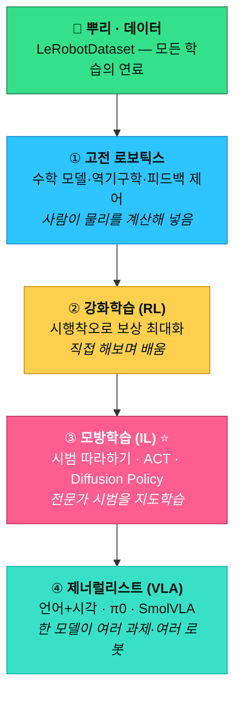
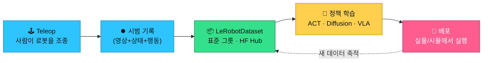
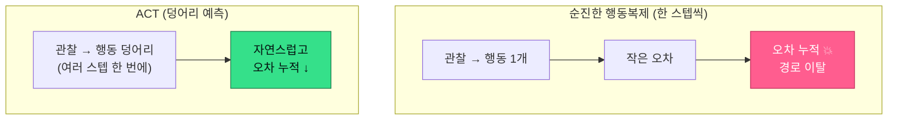
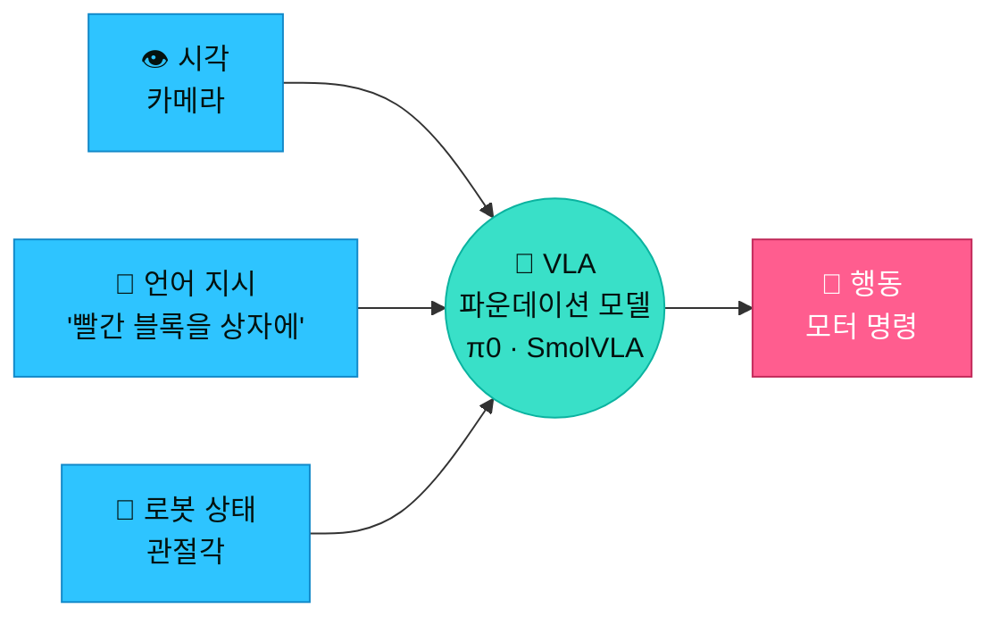

# 로봇은 어떻게 배우나 — LeRobot 튜토리얼 줄기 잡기

> LeRobot의 **"Robot Learning: A Tutorial"** ([HF Space](https://huggingface.co/spaces/lerobot/robot-learning-tutorial) · 원문 논문 [arXiv 2510.12403](https://arxiv.org/abs/2510.12403), 2025-10 · 코드 [github/fracapuano](https://github.com/fracapuano/robot-learning-tutorial))를 **줄기 중심으로** 한글 소화한 것. 원문은 수식·코드가 빽빽하지만, 이 문서는 그걸 걷어내고 **"무엇을 왜 배우나"의 나무 구조**를 비유로 세운다 — 읽으면서 맥락이 잡히도록 일부러 말을 많이 했다. 조사일 2026-07-15.
>
> 이 문서는 [[00-foundations|기초 지도]]의 **🅱 학습 세계**를 한 단계 깊게 판다. 실제 코드로 뭘 돌리나는 [[course-analysis-hf-nvidia|코스 분석]]·[[hardware-and-simulation|하드웨어/시뮬 가이드]], 이 기술을 만드는 회사들은 [[05-robotics-company-atlas|기업 지도]] 참조.

---

## 0. 왜 "사다리"인가 — 한 장으로 보는 전체 줄기

로봇 학습을 처음 보면 RL·모방학습·VLA·디퓨전 같은 용어가 뒤죽박죽 쏟아진다. 하지만 이 튜토리얼의 전체 구조는 **사다리 하나**다. 아래에서 위로 오를수록 **사람이 손으로 짜는 규칙은 줄고, 데이터가 그 자리를 채운다.** 이 축 하나만 잡으면 나머지는 전부 "그 사다리의 몇 번째 칸인가"로 정리된다.

| 칸 | 방식 | 로봇이 배우는 법 | 일상 비유 | 우리 미션 |
|---|---|---|---|---|
| ① 고전 로보틱스 | 수학 모델 | 사람이 물리를 **계산**해 넣음 | 공식대로 푸는 수학 | 토닥토닥(좌우 왕복) |
| ② 강화학습(RL) | 시행착오 | **직접 해보며** 보상 최대화 | 게임을 죽어가며 익힘 | (개념만) |
| ③ 모방학습(IL) | 시범 따라하기 | **전문가 시범**을 지도학습 | 어깨너머로 배우기 | pick & place |
| ④ 제너럴리스트(VLA) | 언어+시각 | **한 모델**이 여러 과제·여러 로봇 | 말로 시키면 알아듣는 조수 | 무궁화꽃(음성 조건) |

> **논문의 핵심 한 줄:** **"Approximate the solution, not the problem."**
> — 세상을 완벽히 **모델링**하려 들지 말고, 데이터로 **해답을 근사**하라. ①의 한계가 왜 ②③④를 낳았는지가 이 한 문장에 다 들어있다.

**돈·연구가 지금 몰리는 칸은 ④(VLA 파운데이션 모델).** 우리 스택(LeRobot·GR00T)이 정확히 이 흐름의 오픈소스 판이다 (→ [[03-physical-ai-players-and-money|뇌 vs 몸]] · [[05-robotics-company-atlas|기업 지도]] §7).

---

## 1. 뿌리는 데이터 — LeRobotDataset

사다리를 오르기 전에 반드시 알아야 할 것: **②③④는 전부 데이터로 배운다.** 그래서 튜토리얼이 제일 먼저 다루는 게 알고리즘이 아니라 **데이터를 담는 그릇**이다. 이 순서 자체가 메시지다 — "알고리즘보다 데이터가 먼저다."

**LeRobotDataset이 뭔가:** 로봇이 한 번 움직일 때 생기는 정보는 여러 종류다. 카메라 영상(눈), 관절 각도·속도 같은 상태(state), 그리고 실제로 준 명령(action). LeRobotDataset은 이 **멀티모달 정보를 하나의 표준 형식**으로 묶어 [Hugging Face Hub](https://huggingface.co/datasets)에 올린다.

**왜 이게 결정적인가 — 세 가지:**
1. **스트리밍** — 수십 GB를 통째로 내려받지 않고, 필요한 구간만 꺼내 쓴다. 노트북에서도 대형 데이터셋을 다룰 수 있다.
2. **표준화 = 규모의 전제** — "어떤 로봇·어떤 과제든 같은 형식"이라야, ④단계에서 **한 모델이 여러 로봇을 한꺼번에 배우는 것**이 가능해진다. 포맷 통일이 곧 파운데이션 모델의 기반.
3. **재현성** — 남의 데이터셋을 그대로 불러와 정책을 재학습·평가할 수 있다. 42식 피어리뷰(서로의 풀이를 재현)와 정확히 같은 정신.

> **초심자 요령:** 새 알고리즘을 배우기 전에 **"내 시범을 데이터로 기록하는 법"**(teleop 녹화 → 데이터셋 push)부터 익혀라. 우리 미션도 결국 이 데이터 만들기에서 시작한다. 데이터가 없으면 위 사다리의 어느 칸도 못 오른다.

---

## 2. 고전 로보틱스 — 되는 것과 안 되는 것

로봇을 **수학으로 계산**해 움직이는 전통 방식. "AI 로봇"의 시대에도 이건 죽지 않았다 — 정해진 환경에선 지금도 최강이다. 다만 **왜 여기서 멈추지 않고 학습으로 넘어갔는지**를 이해하는 게 이 칸의 진짜 목적이다.

**세 가지 도구:**
- **순기구학(forward kinematics)**: 관절 각도가 주어지면 → 손끝이 공간의 어디에 있나. (계산이 쉽다)
- **역기구학(inverse kinematics)**: 손끝을 목표 지점에 두려면 → 관절을 각각 몇 도로? (거꾸로 역산, 조금 더 어렵다)
- **피드백 제어(feedback control)**: 목표와 현재의 오차를 실시간으로 재서 계속 보정. (에어컨 온도조절과 같은 원리)

**되는 것:** 공장처럼 **환경이 고정**되고 물체 위치가 정해져 있으면, 이 방식은 정밀하고 빠르고 안정적이다. 자동차 용접 로봇이 수십 년간 이렇게 돌아왔다. → [[04-arm-hand-eye|팔·손·눈]]에서 봤듯 **"좌표 이동(x, y, z)"은 이미 풀린 문제**다.

**안 되는 것 — 튜토리얼이 꼽은 네 가지 한계:**
1. **모듈 이어붙이기의 취약성** — 감지 → 상태추정 → 계획 → 제어를 각각 따로 만들어 잇는데, **이음새마다 오차가 누적**된다. 앞 단계의 작은 오류가 뒤로 갈수록 커진다.
2. **과제마다 처음부터 재설계** — 새 작업이 생기면 목표·제약·휴리스틱을 사람이 다시 짜야 한다. 확장이 안 된다.
3. **현실은 수식보다 지저분하다** — 마찰·접촉·물렁한 물체는 강체(rigid body) 가정으로 정확히 못 담는다. "컵을 무르게 쥐기" 같은 건 수식이 감당 못 함.
4. **데이터를 못 쓴다** — 세상에 쏟아지는 로봇 주행·조작 데이터를 활용할 통로가 없다. 이게 학습 방식이 가진 결정적 우위.

> **논문 표현:** 고전 방식은 **"a jack of all trades, master of none"**(이것저것 다 하지만 뭐 하나 완벽하진 않은) 상태다. 그래서 데이터로 배우는 쪽으로 넘어간다.
>
> **우리 연결:** 첫 미션 **"토닥토닥"(좌우 왕복으로 등 두드리기)**이 성공 문턱이 낮은 이유가 이것 — 정해진 궤적을 왕복하는 건 ①(고전 제어)만으로도 충분하다. 그래서 초등학생도 시작할 수 있는 첫 계단이 된다.

---

## 3. 강화학습(RL) — 시행착오로 배우기

사다리의 두 번째 칸. **직접 해보고, 보상을 최대화**하는 쪽으로 스스로 정책(policy)을 다듬는다. 물리 모델을 주지 않고, **경험(데이터)**만으로 배운다 — 강아지에게 간식으로 훈련시키는 것과 같은 원리다.

**핵심 틀 (용어는 뒤 §7 사전에):**
- **MDP** — 상태(state) → 행동(action) → 보상(reward) → 다음 상태로 이어지는 판. 로봇 제어를 이 틀에 얹는다.
- **가치함수·정책** — "이 상태에서 이 행동이 장기적으로 얼마나 좋은가"를 학습.
- 대표 알고리즘: **DQN · DDPG · SAC · PPO** (이름만 알아두면 됨, 지금 깊이 팔 필요 없음).

**매력:** 감지부터 행동까지 **하나의 파이프라인**으로, 고차원 센서(카메라 등)를 그대로 먹여 학습한다. §2의 "모듈 이어붙이기 취약성"을 우회한다.

**현실의 벽 — 왜 실물에 바로 못 쓰나:**
- **샘플 비효율(sample inefficiency)** — 엄청난 시행 횟수가 필요한데, **실물 하드웨어는 데이터 생성이 느리다.** 로봇이 수만 번 실패하며 배우기엔 시간·마모 비용이 크다.
- **Reality gap** — 시뮬레이터에서 배운 게 실물에서 깨진다(시뮬 물리는 단순화돼 있으니까). 해법 = **도메인 랜덤화**(시뮬의 마찰·조명·질량을 무작위로 흔들어 강건하게 만듦). 그래도 수작업 튜닝이 든다.
- **보상 설계(reward design)** — "셔츠 개기 성공?" 같은 **희소 보상**은 신호가 드물어 학습이 어렵고, 촘촘한 보상은 사람 전문성이 든다. 보상을 잘못 설계하면 로봇이 엉뚱한 꼼수를 배운다.
- **안전(safety)** — 학습 초기의 정책은 위험하게 움직인다 → 사람 감독·환경 리셋이 계속 필요(**HIL**, human-in-the-loop).

> **결론:** 순수 RL은 이론적으로 매력적이지만 **"실물에서 대규모로 배치하긴 아직 어렵다"**가 튜토리얼의 판정. 그래서 실전에선 다음 칸(모방학습)이 훨씬 자주 쓰인다. RL은 **개념만 잡고 넘어가도 된다.**

---

## 4. 모방학습(IL) — 시범 따라하기 ⭐

우리 미션과 **가장 가까운** 칸. 보상을 설계하는 대신, **전문가의 시범을 보고 따라한다** = 지도학습(supervised learning). RL의 "보상 설계·안전" 골칫거리를 피해가서, 지금 현장에서 가장 실용적인 방법이다.

**행동복제(Behavioral Cloning, BC):** "이 관찰(observation)일 때 전문가는 이 행동(action)을 했다"는 쌍을 잔뜩 모아 그대로 흉내 내게 학습. 시범 데이터(§1의 LeRobotDataset)만 있으면 된다.

여기서 튜토리얼이 강조하는 두 핵심 기법:

### 4-1. ACT — Action Chunking with Transformers
- **문제:** 순진한 BC는 **한 스텝에 한 행동**만 예측한다. 그런데 매 스텝 조금씩 틀리면 **오차가 눈덩이처럼 쌓인다**(compounding error) — 처음엔 미세한 어긋남이 나중엔 완전히 경로를 벗어남.
- **아이디어:** 사람 동작은 독립된 낱개가 아니라 **덩어리(chunk)로 이어진다.** ACT는 **여러 스텝의 미래 행동을 한 번에** 예측한다(트랜스포머의 시퀀스 예측력 활용).
- **효과:** (1) 자연스러운 동작 상관관계 포착, (2) 한 스텝 예측 병목 완화, (3) **오차 누적 감소.** 지금 저가 로봇팔 모방학습의 사실상 표준.

### 4-2. Diffusion Policy — 노이즈에서 동작을 "빚어내기"
- **아이디어:** 행동을 곧바로 계산하지 않고, **무작위 노이즈에서 시작해 점점 다듬어**(denoising) 실제 행동을 생성한다. 이미지 생성 AI(Stable Diffusion 등)와 **똑같은 원리를 행동에 적용**한 것.
- **강점:** **여러 개의 정답(멀티모달)**을 표현할 수 있다. "컵을 왼쪽으로 돌려도 되고 오른쪽으로 돌려도 되는" 상황에서, 단순 회귀는 둘의 평균(=둘 다 아닌 이상한 값)을 내지만 디퓨전은 하나를 골라 자연스럽게 수행한다. 분포가 살짝 달라져도 견딘다.

> **우리 연결:** 두 번째 미션 **pick & place**가 정확히 모방학습의 교과서 사례다. "몇 번 시범 보여주기 → 로봇이 흉내" — 그 앞단계가 §1의 시범 기록. 즉 우리 커리큘럼의 심장은 이 4번 칸에 있다. RL(§3)은 배경지식, 모방학습(§4)이 실전이다.

---

## 5. 제너럴리스트(VLA) — 말로 시키는 로봇

사다리 꼭대기. **한 과제당 한 정책**을 벗어나, **한 모델이 여러 과제·여러 로봇**을 다룬다. 지금 수십억 달러가 몰리는 프론티어다.

- **VLA (Vision-Language-Action)** = **시각 + 언어 지시**를 받아 **행동**을 낸다. "빨간 블록을 상자에 넣어" 같은 자연어로 조건을 준다. LLM(언어모델)이 로봇의 몸을 얻은 셈.
- **π₀ (파이-제로)** — 방대한 **멀티태스크·멀티로봇** 데이터로 학습한 제너럴리스트. 언어 조건으로 서로 다른 과제·기체(embodiment)를 **하나의 학습 공간**으로 묶어, 처음 보는 과제도 어느 정도 해내는 **제로샷 전이**까지 노린다. ([Physical Intelligence](https://www.physicalintelligence.company/)사 개발 → [[05-robotics-company-atlas|기업 지도]] §7)
- **SmolVLA** — π₀ 계열을 **작고 효율적으로** 줄여 **실배포**를 겨냥한 버전. 이름 그대로 "Smol(작은) VLA" — 비슷한 능력을 훨씬 적은 모델 크기로. Hugging Face가 오픈소스로 공개해, 우리 같은 학습자가 실제로 돌려볼 수 있다.

> **프론티어의 전환:** **"과제마다 전용 정책을 짠다"(고전 BC) → "가진 데이터 전부로 파운데이션 모델 하나를 학습하고, 언어로 조건을 준다"(VLA).**
>
> **우리 연결:** 세 번째 미션 **"무궁화꽃이 피었습니다"**(말하는 동안 움직이고 발화가 끝나는 순간 정지)는 **언어가 로봇 행동을 조건 짓는다**는 점에서 VLA의 개념적 사촌이다. 음성 인식·종료 감지·잡음 분리 같은 열린 변주가 있어 피어리뷰가 의미를 갖고, 오징어게임 덕에 글로벌 인지도가 있어 **피칭 데모의 에이스**가 된다.

---

## 6. 그래서 뭘 배우고 뭘 건너뛰나 (초심자 로드맵)

사다리 전체를 다 정복할 필요는 없다. 우리 목표(저가 로봇팔로 미션 수행 + 피어리뷰)에 맞춰 **무게중심을 어디 둘지**가 핵심이다.

| 칸 | 지금 할 것 | 깊이 |
|---|---|---|
| 🌱 데이터(§1) | **먼저** — teleop으로 내 시범을 LeRobotDataset로 기록 | ⭐⭐⭐ 입구 |
| ① 고전(§2) | "왜 학습으로 넘어왔나"의 배경만. 좌표 이동은 이미 풀림 → 시간 쓰지 말 것 | ⭐ 배경 |
| ② RL(§3) | **개념만.** 실물 대규모엔 아직 안 쓰임 | ⭐ 개념 |
| ③ 모방(§4) | **핵심.** BC·ACT로 우리 미션(토닥→pick&place)이 다 풀림 | ⭐⭐⭐ 실전 |
| ④ VLA(§5) | "다음 스텝"으로 링크만. 무궁화꽃 단계에서 π0·SmolVLA 손댐 | ⭐⭐ 심화 |

> **한 문장 지도:** **데이터로 시작 → 시범을 모방(ACT) → 언어로 일반화(VLA).** 아래로 내려갈수록 규칙, 위로 갈수록 데이터. 우리는 뿌리(데이터)와 ③번 칸(모방)에 무게를 싣고, ④번(VLA)은 데모·피칭에서 꽃을 피운다.

---

## 7. 용어 사전 (읽다 막히면 여기로)

| 용어 | 한 줄 뜻 |
|---|---|
| **Policy(정책)** | "이 상황에서 무슨 행동을 할까"를 정하는 함수 = 로봇의 두뇌 |
| **Teleop(원격조작)** | 사람이 로봇을 직접 조종하는 것. 시범 데이터를 만드는 방법 |
| **Behavioral Cloning(행동복제/BC)** | 전문가 시범을 지도학습으로 그대로 흉내 내는 모방학습 |
| **ACT** | Action Chunking with Transformers. 여러 스텝 행동을 덩어리로 예측해 오차 누적을 줄임 |
| **Diffusion Policy** | 노이즈에서 시작해 행동을 다듬어 생성. 여러 정답(멀티모달)에 강함 |
| **VLA** | Vision-Language-Action. 시각+언어를 받아 행동을 내는 로봇 파운데이션 모델 |
| **π₀ / SmolVLA** | 대표 VLA 모델. SmolVLA는 경량·오픈소스 버전 |
| **Embodiment(임바디먼트)** | 로봇의 "몸" 종류(팔·4족·휴머노이드 등). 멀티임바디먼트 = 여러 몸을 한 모델로 |
| **MDP** | 상태→행동→보상 틀. RL이 문제를 얹는 수학 구조 |
| **Reality gap** | 시뮬에서 배운 게 실물에서 깨지는 간극. 도메인 랜덤화로 완화 |
| **도메인 랜덤화** | 시뮬 물리(마찰·조명·질량)를 무작위로 흔들어 실물에 강건하게 |
| **HIL** | Human-in-the-loop. 학습 중 사람이 개입·감독하는 것 |
| **Compounding error** | 한 스텝씩 예측할 때 작은 오차가 누적돼 경로를 벗어나는 문제 |
| **Zero-shot transfer** | 학습에서 본 적 없는 과제를 추가 학습 없이 해내는 것 |

---

## 관련 (Related)
- 🎨 [[atlas-dashboard|학습 대시보드 (인터랙티브 HTML)]] — 사다리·파이프라인·기업 지도의 컬러 버전
- [[00-foundations|기초 지식 지도]] — 🅰 규칙 세계 vs 🅱 학습 세계
- [[05-robotics-company-atlas|기업 지도]] — 이 기술(VLA 등)을 만드는 회사들
- [[course-analysis-hf-nvidia|코스 분석 (HF·NVIDIA)]] — 실제 실습 코스로 뭘 돌리나
- [[hardware-and-simulation|하드웨어/시뮬 가이드]] — Mac에서 되는 경로
- [[03-physical-ai-players-and-money|플레이어와 돈 (뇌 vs 몸)]] — VLA에 돈이 몰리는 이유
- [[04-arm-hand-eye|팔·손·눈]] — 좌표는 풀렸고 인지가 병목
